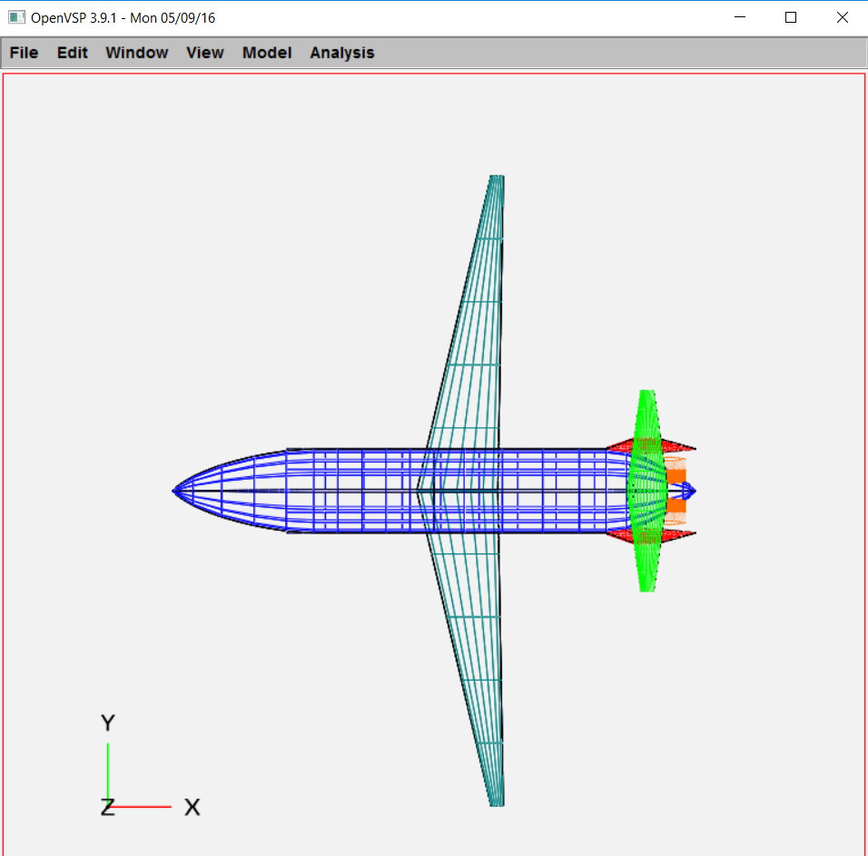
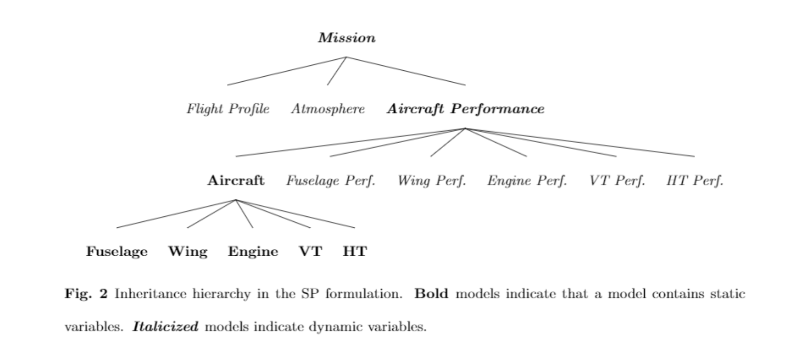

SPaircraft 101
**************

These instructions will help you run SPaircraft for the first time!

SPaircraft.py - set of aircraft models
=======================================
**SPaircraft.py** contains a set of methods that are used to optimize different aircraft configurations.

The process to create and run one of these models is general. The following definitions are required:

- **Nclimb**, number of climb segments
- **Ncruise**, number of cruise segments
- **Nmission**, number of missions to simulate
- **objective**, which is a string designating the objective function
- **aircraft**, which is a string designating the type of aircraft

The following imports are also required::

    import numpy as np

    # GPkit tools
    from gpkit import units, Model
    from gpkit import Variable, Model, units, SignomialsEnabled, SignomialEquality, Vectorize
    from gpkit.constraints.bounded import Bounded as BCS

    # Constant relaxation heuristic for SP solve
    from relaxed_constants import relaxed_constants, post_process

    # Mission model
    from D8 import Mission
For the demonstration, we define these as::

    Nclimb = 3
    Ncruise = 2
    Nmission = 1
    objective = 'W_{f_{total}}' # minimizing fuel burn
    aircraft = 'D82' # optimizing the D82 configuration
Now, we have the basic building blocks of a model::

    m = Mission(Nclimb, Ncruise, objective, aircraft, Nmission)
Since we are optimizing a D8.2 aircraft, we need to import the appropriate parameter substitutions::

    from subsD82 import getD82subs
    substitutions = getD82subs()
And we need to specify a mission range::

    substitutions.update({'R_{req}': 3000.*units('nmi')})
We can update our model **m** with the substitutions::

    m.substitutions.update(substitutions)
    m = Model(m.cost, BCS(m))

We use **Bounded** (BCS) in SPaircraft to make sure that the models are stable even if not all variables are well-constrained.
Users are warned about unbounded variables at the end of the solve.

We implement the relaxed constants heuristic to solve the SP::

    m_relax = relaxed_constants(m, None)

Now we solve, and print the results::

    sol = m_relax.localsolve(verbosity=4, iteration_limit=200, reltol=0.01)
    print sol.table()

Congratulations!

Solution visualization
======================

We implement an integration with `OpenVSP`_ to show the outer mold line (OML) of each aircraft configuration after they are optimized with SPaircraft.
To be able to use this functionality, the users needs to download and install the OpenVSP software, which is available `here`_.

.. _OpenVSP: http://www.openvsp.org/
.. _here: http://www.openvsp.org/download.php

Once OpenVSP is successfully installed, the .vsp3 files in the **VSP** directory will be recognized and accessible. Clicking any of these will
open up the OpenVSP interface, which looks similar to this:

As an example, to be able to visualize the optimized D8.2 aircraft within our solution **sol**, we import the following functions in the Python console::

    # VSP visualization tools
    from saveSol import updateOpenVSP, genDesFile, genDesFileSweep

These are generated by loading the Design Variable (.des) files autogenerated from SPaircraft through a .vspscript.
To generate a .des file for the D8.2 aircraft, type this into the console::

    genDesFile(sol,'D82')

This modifies the design0.des file within the **VSP**  directory. To load this design, click **File**, and select **Run Script...**.
In the pop-up, select **reload.vspscript** and voila! You have generated the OML of the D8.2 aircraft.

Static vs. Performance Models
=============================

.. image:: modelArchitecture.pdf
    :width: 45%

To allow for multipoint aircraft optimization over multiple flight segments, missions, or loading cases,
two models are created for each aircraft component - a **static** and a **performance** model.
The static model contains all variables and constraints that do not change between operating points,
such as component weights and dimensions. Performance models contain all constraints and variables that change between operating points,
such as air speeds, lift coefficients, and fuel quantities. To simulate multiple aircraft missions,
the performance models and the static variables that change between missions (eg. number of passengers and fuel weight)
are vectorized. When a model is vectorized, all the variables it contains become vectors, with each element corresponding
to a different operating point. Figure 1 provides a visual representation of static and performance models.

Model hierarchy
===============

The SP formulation develops implements a hierarchy in optimization parameter and variable definitions,
due to the serial nature of software engineering tools. This hierarchy is shown in Figure 2, where each higher level in the framework
inherits the variables, parameters, and constraints in the layers below.

Single-mission optimization
===========================

Under construction...

Multi-mission optimization
==========================

Under construction...
