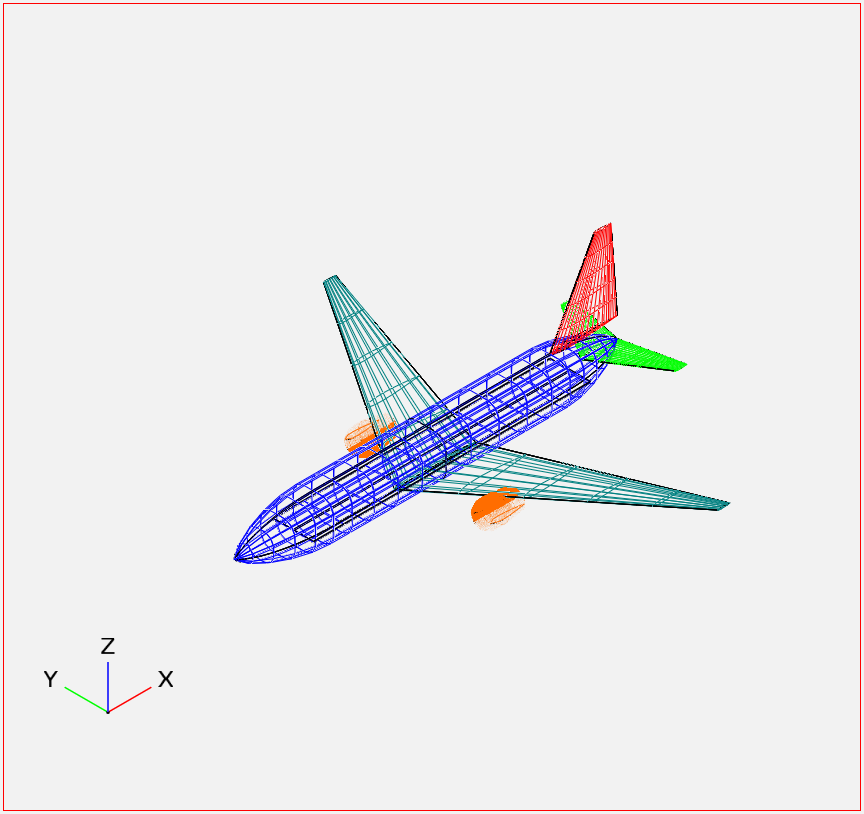
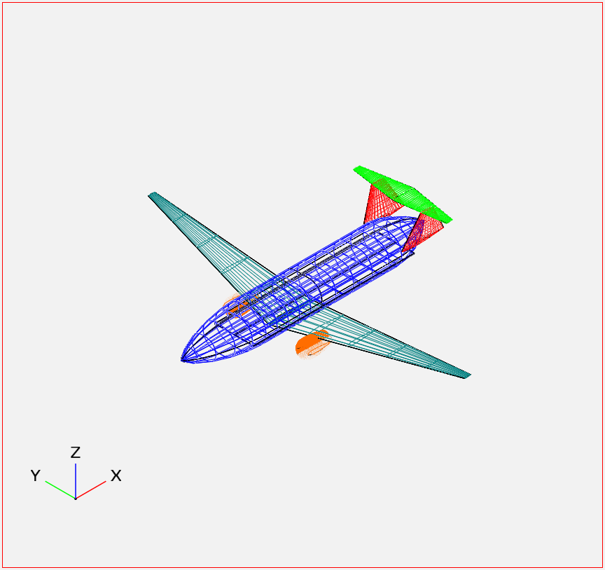
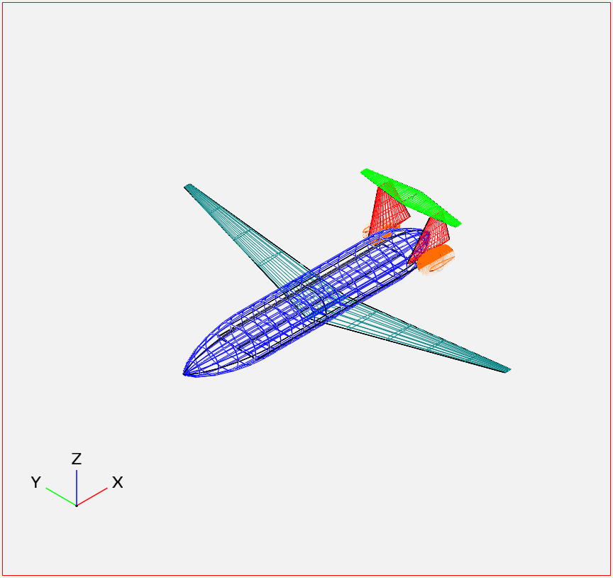

Available Models
****************

Aircraft Families
=================

We define the range and passenger payload requirements for the families of aircraft we have designed using SPaircraft.

B737
----

- Range: 3000 nmi
- Passengers: 180

777
---

- Range: 6000 nmi
- Passengers: 450

Aircraft Configurations
=======================

We define the different aircraft configurations that we can optimize using SPaircraft.

Tube-tail-wing
--------------

Double-bubble with wing-podded engines
--------------------------------------

Double-bubble with rear-podded engines
--------------------------------------

Double-bubble with boundary layer ingestion
-------------------------------------------

.. image:: D82-1.png
    :width: 45%
