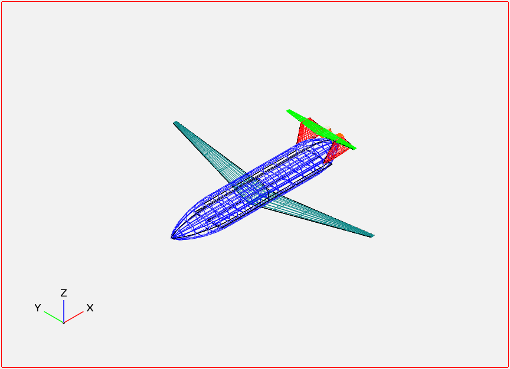

.. STACD documentation master file, created by
   sphinx-quickstart on Sat May 06 14:21:15 2017.
   You can adapt this file completely to your liking, but it should at least
   contain the root `toctree` directive.

Welcome to STACD!
=================

    Signomial Transonic AirCraft Design is a signomial programming compatible transonic aircraft conceptual design optimization tool.
    It is of similar level of fidelity as TASOPT, and can perform the single- and multi-mission optimization of many
    different configurations of aircraft.

Table of contents:
==================
    .. toctree::
        :maxdepth: 2
        STACD101
        Installation
        Debugging
